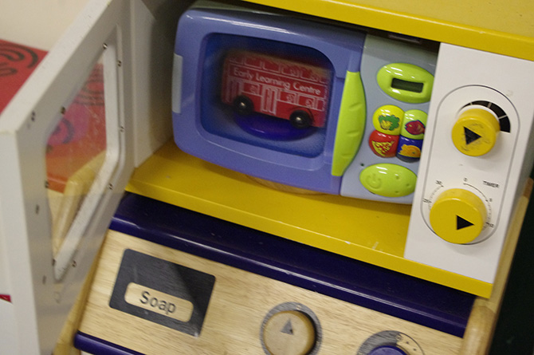

**WARNING: THIS PAGE IS A JOKE**

#Microwaveception
*Microwaveception* occurs when one or more microwaves are place within one another, resulting in a Microwave within a Microwave, within a Microwave, within a Microwave, within a Microwave, ad infinitum.

*Microwaveception* has come under increasing controversy from Health and Safety since its inception.

##History
It is thought that the first case of Microwaveception occurred on the 18th July 2012, when the Playgroup placed a bus inside a microwave, inside a microwave.

##Controversy
Due to its nature, *Microwaveception* can cause mass destruction, lots of electricity everywhere, explosions and death to the hilarity of those around it.

Health and Safety officers strongly oppose *Microwaveception* and many MP's are pushing for the Anti-Microwaveception Act 2012 to become law, making *Microwaveception* a criminal offence.

The Scientist Stephen Hawking, when interviewed about *Microwaveception*, predicted that if enough microwaves where put inside of one another, and turned on, the results may destroy the fabric of space time, resulting in the end of the universe.